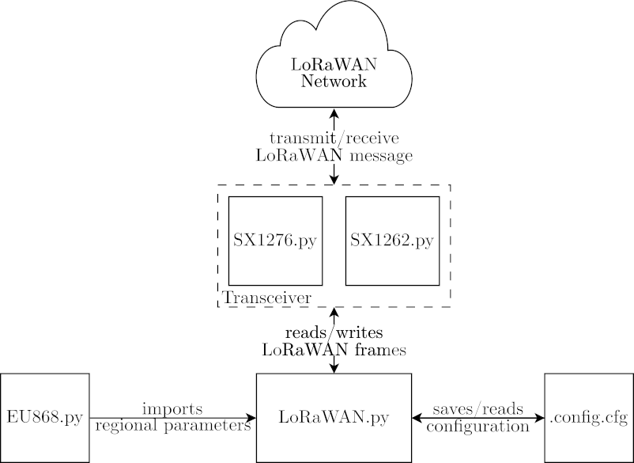

# LoRaWAN Stack for Micropython

This is a LoRa and LoRaWAN stack purely written in [Micropython](https://micropython.org/). The main development is done using [MoleNet](https://molenet.org/) and [HelTec](https://heltec.org/project/wifi-lora-32v2/).

For CMAC [this library](https://github.com/KianBahasadri/micropython-aes-cmac) is used. It is imported as a submodule in source/extern. For usage import cmac.py as a library.

# How to use this code?

We assume that you already have MicroPython installed on your devices. For the
MoleNet ESP32-S3, you can follow [this manual](https://micropython.org/download/ESP32_GENERIC_S3/).

Using uv, you can execute the tool using

    uv run esptool ...

## Python Environment

The Python environment (**NOT** the micropython environment) is managed using
[uv](https://docs.astral.sh/uv/). Please make sure you have installed it
according to [the docs](https://docs.astral.sh/uv/getting-started/installation/). For most operating systems, the following line should work:

    curl -LsSf https://astral.sh/uv/install.sh | sh

Afterwards, you should be able to use it for example to open a repl to the
connected device:

    uv run mpremote repl

You can exit the repl by pressing <ctrl>+x

## Upload Driver
There is an upload script in `src/upload.sh`. This has been tested on Linux and
should also work on MacOS. It requires `uv` to be installed (see above).

## Example Code
The example code is available in `src`. Please make sure you uncomment the
section for the hardware you would like to use. Also, comment the not required
hardware. Upload everything with the upload script.

